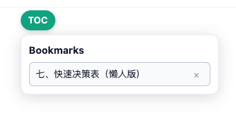

# ChatGPT Answer TOC Bookmarks

Save table-of-contents bookmarks for ChatGPT answers and jump back instantly.

## Features
- Create bookmarks from selected text via the right-click menu.
- View and jump to saved points from the in-page TOC panel.
- Keep bookmarks locally per conversation.

## Project Structure
- `extension/` - Browser extension code (content scripts, background worker, assets).

## Development
No pre-installed runtime dependencies are required for development.
Use the browser extension directly from the `extension/` directory.

Load the extension in Chrome:
1. Open `chrome://extensions`.
2. Enable Developer mode.
3. Click "Load unpacked" and select `extension/`.

## Naming
This project is named after its core feature: a table-of-contents bookmark list for ChatGPT answers.

## License
GPL-3.0-only. See `LICENSE`.
